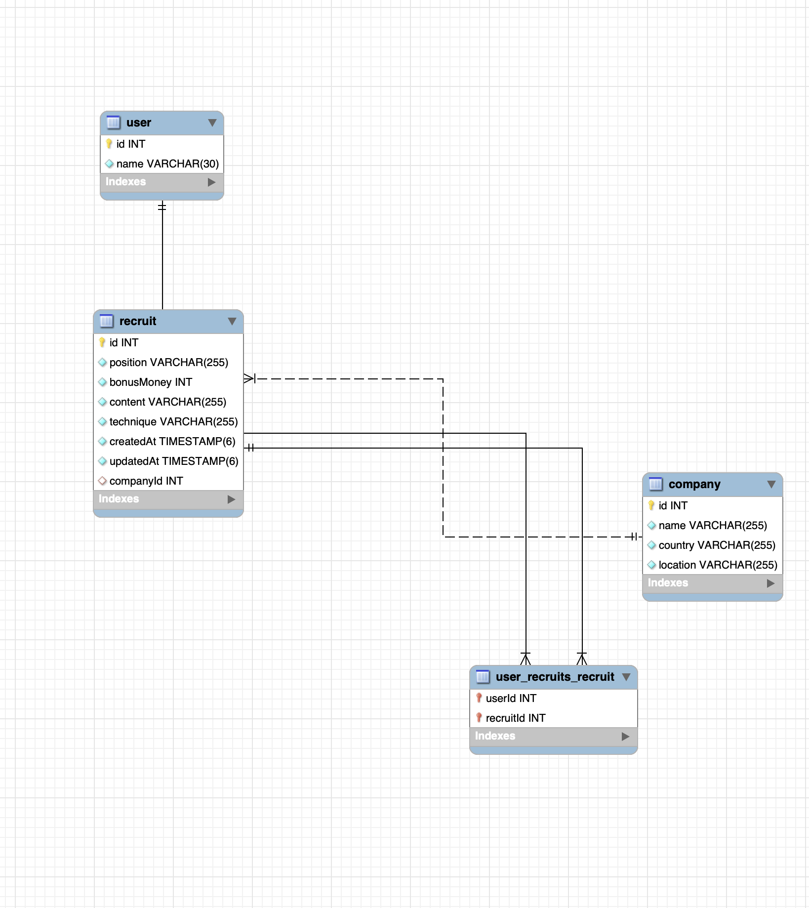

## Installation

```bash
$ npm install
```

## Running the app

```bash
# development
$ npm run start
```

## Test

```bash
# unit tests
$ npm run test
```

---

## 활용 기술 스택


- Dev-Environment: Node.js
- Language: Typescript
- Framework: Express
- ORM: type-orm
- RDBMS: MySQL

<br>

---

<br>

## 파일구조

```readme
📦src
 ┣ 📂commons
 ┃ ┣ 📜exceptions.ts
 ┃ ┗ 📜returnData.ts
 ┣ 📂configs
 ┃ ┣ 📜database.ts
 ┃ ┗ 📜index.ts
 ┣ 📂controllers
 ┃ ┣ 📜companyController.ts
 ┃ ┣ 📜index.ts
 ┃ ┣ 📜recruitController.ts
 ┃ ┗ 📜userController.ts
 ┣ 📂interfaces
 ┃ ┣ 📂company
 ┃ ┣ 📂recruit
 ┃ ┗ 📂user
 ┣ 📂middlewares
 ┃ ┗ 📜errorHandler.ts
 ┣ 📂models
 ┃ ┣ 📂responseData
 ┃ ┃ ┗ 📜recruitResponse.ts
 ┃ ┣ 📜Company.entity.ts
 ┃ ┣ 📜Recruit.entity.ts
 ┃ ┣ 📜User.entity.ts
 ┃ ┗ 📜index.ts
 ┣ 📂repositories
 ┃ ┣ 📂repoParams
 ┃ ┃ ┣ 📜createNewCompanyReq.ts
 ┃ ┃ ┣ 📜createNewRecruitReq.ts
 ┃ ┃ ┗ 📜updateRecruitReq.ts
 ┃ ┣ 📂test
 ┃ ┃ ┗ 📜userRepository.test.ts
 ┃ ┣ 📜companyRepository.ts
 ┃ ┣ 📜index.ts
 ┃ ┣ 📜recruitRepository.ts
 ┃ ┗ 📜userRepository.ts
 ┣ 📂routers
 ┃ ┣ 📜company.ts
 ┃ ┣ 📜index.ts
 ┃ ┣ 📜recruit.ts
 ┃ ┗ 📜user.ts
 ┣ 📂services
 ┃ ┣ 📜companyService.ts
 ┃ ┣ 📜index.ts
 ┃ ┣ 📜recruitService.ts
 ┃ ┗ 📜userService.ts
 ┣ 📂test
 ┗ 📜app.ts
```

<br>

---

<br>

## ERD Diagram



<br>

---

<br>

## API 정보구현

### 유저 (User)

|     URL     | Method |             기능명             |    요구사항     |
| :---------: | :----: | :----------------------------: | :-------------: |
|   /user/    |  GET   |         전체 유저 조회         |  본인직접 구현  |
|  /user/:id  |  GET   | 유저 아이디(id)로 유저정보조회 |  본인직접 구현  |
|   /user/    |  POST  |            유저생성            |  본인직접 구현  |
| /user/apply |  POST  |     유저가 채용공고에 지원     | 가산점 요소(#6) |

<br>

### 회사 (Company)

|     URL      | Method |             기능명             |   요구사항    |
| :----------: | :----: | :----------------------------: | :-----------: |
|  /company/   |  GET   |         전체 회사 조회         | 본인직접 구현 |
| /company/:id |  GET   | 회사 아이디(id)로 회사정보조회 | 본인직접 구현 |
|  /company/   |  POST  |           회사 생성            | 본인직접 구현 |
| /company/:id | DELETE |           회사 삭제            | 본인직접 구현 |

<br>

### 채용공고 (Recruit)

|     URL      | Method |                    기능명                    |     요구사항      |
| :----------: | :----: | :------------------------------------------: | :---------------: |
|  /recruit/   |  POST  |                채용공고 등록                 |   필수 요소(#1)   |
| /recruit/:id |  PUT   | 채용공고 아이디(id)에 해당하는 채용공고 수정 |   필수 요소(#2)   |
| /recruit/:id | DELETE | 채용공고 아이디(id)에 해당하는 채용공고 삭제 |   필수 요소(#3)   |
|  /recruit/   |  GET   |              채용공고 목록 조회              |  필수 요소(#4-1)  |
| /recruit/url |  GET   |            채용공고 검색기능 구현            | 가산점 요소(#4-2) |
| /recruit/:id |  GET   |             채용상세 페이지 조회             |   필수 요소(#5)   |

<br>

<hr>

## Models

### User.entity.ts - 유저 모델

```typescript
import {
  Column,
  Entity,
  JoinTable,
  ManyToMany,
  OneToMany,
  PrimaryGeneratedColumn,
} from 'typeorm';
import { Recruit } from './Recruit.entity';

@Entity()
export class User {
  @PrimaryGeneratedColumn('increment')
  id: number;

  @Column('varchar', { length: 30, nullable: false })
  name!: string; // 지원자 이름

  // 지원한 채용공고
  @ManyToMany(() => Recruit)
  @JoinTable()
  recruits: Recruit[];
}
```

<br>

### Company.entity.ts - 회사 모델

```typescript
import {
  Column,
  Entity,
  OneToMany,
  PrimaryColumn,
  PrimaryGeneratedColumn,
} from 'typeorm';
import { Recruit } from './Recruit.entity';

@Entity()
export class Company {
  @PrimaryGeneratedColumn('increment')
  id: number;

  @Column({ nullable: false })
  name: string; // 회사명

  @Column({ nullable: false, default: '대한민국' })
  country: string; // 국가

  @Column()
  location: string; //지역

  // 회사가 올린 채용공고
  @OneToMany((type) => Recruit, (recruit) => recruit.company, {
    cascade: true, // 회사 삭제시 - 등록한 채용공고도 같이삭제.
  })
  recruits: Recruit[];
}
```

<br>

### Recruit.entity.ts - 채용공고 모델

```typescript
import configs from '../configs';
import {
  Column,
  Entity,
  ManyToOne,
  CreateDateColumn,
  UpdateDateColumn,
  PrimaryGeneratedColumn,
} from 'typeorm';
import { Company } from './Company.entity';

@Entity()
export class Recruit {
  @PrimaryGeneratedColumn('increment')
  id: number;

  @Column()
  position: string; //채용포지션

  @Column()
  bonusMoney: number; //채용보상금

  @Column()
  content: string; //채용내용

  @Column()
  technique: string; // 사용기술

  @CreateDateColumn({
    type: 'timestamp',
    default: () => 'CURRENT_TIMESTAMP(6)',
  })
  createdAt: Date;

  @UpdateDateColumn({
    type: 'timestamp',
    default: () => 'CURRENT_TIMESTAMP(6)',
  })
  updatedAt: Date;

  // 회사 아이디 (FK)
  @ManyToOne((type) => Company, (company) => company.recruits, {
    onDelete: 'CASCADE',
    onUpdate: 'CASCADE',
  })
  company: Company;
}
```

<br>

---

<br>

## 요구사항 구현 과정 - (요구사항: #1, #2, #3, #4-1, #4-2, #5)

### Router

> [파일위치] /src/routers/recruit.ts

```ts
import { Router } from 'express';
import errorHandlers from '../middlewares/errorHandler';
import {
  createNewRecruit,
  updateRecruit,
  allRecruits,
  detailRecruit,
  deleteRecruit,
  searchRecruits,
} from '../controllers/recruitController';

const router = Router();

router.post('/', createNewRecruit, errorHandlers); // 채용공고 생성
router.get('/', allRecruits, errorHandlers); // 모든 채용공고 조회
router.get('/url', searchRecruits, errorHandlers); //채용공고 검색
router.get('/:id', detailRecruit, errorHandlers); // 상세페이지 조회
router.put('/:id', updateRecruit, errorHandlers); // 채용공고 수정
router.delete('/:id', deleteRecruit, errorHandlers); //채용공고 삭제

export default router;
```

<br><br>

### Controller

> [파일위치] /src/controllers/recruitController.ts

```ts
import { Request, Response, NextFunction } from 'express';
import {
  createNewRecruitService,
  updateRecruitService,
  allRecruitsService,
  detailRecruitService,
  deleteRecruitService,
  searchRecruitsService,
} from '../services/recruitService';

/*
 * @ [POST] /recruit/
 * @ 채용공고 등록
 * @ 필수 요구사항 #1
 */
export const createNewRecruit = async (
  req: Request,
  res: Response,
  next: NextFunction,
) => {
  try {
    const { position, bonusMoney, content, technique, cmp_id } = req.body;
    const result = await createNewRecruitService(
      cmp_id,
      content,
      position,
      technique,
      bonusMoney,
    );

    return res.status(200).json(result);
  } catch (error) {
    next(error);
  }
};

/*
 * @ [PUT] /recruit/:id
 * @ 채용공고 수정
 * @ 필수 요구사항 #2
 */
export const updateRecruit = async (
  req: Request,
  res: Response,
  next: NextFunction,
) => {
  try {
    const { id } = req.params;

    const { position, bonusMoney, content, technique, cmp_id } = req.body;
    await updateRecruitService(
      parseInt(id, 10),
      cmp_id,
      content,
      position,
      technique,
      bonusMoney,
    );
    return res.status(203).json();
  } catch (error) {
    next(error);
  }
};

/*
 * @ [DELETE] /recruit/:id
 * @ 채용공고 삭제
 * @ 필수 요구사항 #3
 */
export const deleteRecruit = async (
  req: Request,
  res: Response,
  next: NextFunction,
) => {
  try {
    const { id } = req.params;
    await deleteRecruitService(parseInt(id, 10));
    return res.status(203).json();
  } catch (error) {
    next(error);
  }
};

/*
 * @ [GET] /recruit/
 * @ 채용공고 목록가져오기
 * @ 필수 요구사항 #4-1
 */
export const allRecruits = async (
  req: Request,
  res: Response,
  next: NextFunction,
) => {
  try {
    const result = await allRecruitsService();
    return res.status(200).json(result);
  } catch (error) {
    next(error);
  }
};

/*
 * @ [GET] /recruit/:id
 * @ 채용공고 상세페이지 조회
 * @ 필수+선택 요구사항 #5
 */
export const detailRecruit = async (
  req: Request,
  res: Response,
  next: NextFunction,
) => {
  try {
    const { id } = req.params;
    const result = await detailRecruitService(parseInt(id, 10));
    return res.status(200).json(result);
  } catch (error) {
    next(error);
  }
};

/*
 * @ [GET] /recruit/url?search=검색용어
 * @ 채용공고 검색
 * @ 선택 요구사항(가산점) #4-2
 */
export const searchRecruits = async (
  req: Request,
  res: Response,
  next: NextFunction,
) => {
  try {
    const { search } = req.query;
    const result = await searchRecruitsService(search);
    return res.status(200).json(result);
  } catch (error) {
    next(error);
  }
};
```

<br><br>

### Service

> [파일위치] /src/service/recruitService.ts

```ts
import { createNewRecruitReq } from '../repositories/repoParams/createNewRecruitReq';
import {
  createNewRecruit,
  findOneRecruit,
  updateRecruit,
  allRecruits,
  detailRecruit,
  getOtherRecruits,
  deleteRecruit,
  searchRecruits,
} from '../repositories/recruitRepository';

import { updateRecruitReq } from '../repositories/repoParams/updateRecruitReq';

import {
  RecruitmentData,
  RecruitmentDetail,
} from '../models/responseData/recruitResponse';

import {
  DataNotFoundException,
  IllegalArgumentException,
} from '../commons/exceptions';

/*
 * @ 채용공고 등록
 * @ 필수 요구사항 #1
 */
export const createNewRecruitService = async (
  cmp_id: number,
  content: string,
  position: string,
  technique: string,
  bonusMoney?: number,
) => {
  const param = new createNewRecruitReq();
  param.position = position;
  param.bonusMoney = bonusMoney;
  param.content = content;
  param.technique = technique;
  param.cmp_id = cmp_id;

  const _result = await createNewRecruit(param);
  const result = new RecruitmentData(
    _result.id,
    _result.company.name,
    _result.company.country,
    _result.company.location,
    _result.position,
    _result.bonusMoney,
    _result.technique,
  );

  return result;
};

/*
 * @ 채용공고 수정
 * @ 필수 요구사항 #2
 */
export const updateRecruitService = async (
  r_id: number,
  cmp_id: number,
  content?: string,
  position?: string,
  technique?: string,
  bonusMoney?: number,
) => {
  const updated = new updateRecruitReq();
  let updateFlag = false; // 수정안됨으로 초기화

  // 수정이전 채용공고 찾기
  const before = await findOneRecruit(cmp_id, r_id);

  // content 가 수정됐는지 체크
  if (before.content !== content) {
    updated.content = content;
    updateFlag = true;
  }

  // position 가 수정됐는지 체크
  if (before.position !== position) {
    updated.position = position;
    updateFlag = true;
  }

  // technique 가 수정됐는지 체크
  if (before.technique !== technique) {
    updated.technique = technique;
    updateFlag = true;
  }

  // bonusMoney 가 수정됐는제 체크
  if (before.bonusMoney !== bonusMoney) {
    updated.bonusMoney = bonusMoney;
    updateFlag = true;
  }

  if (!updateFlag) {
    // false => 수정안됨 상태라면 수정없이 리턴.
    return;
  }

  await updateRecruit(updated, r_id);
};

/*
 * @ 채용공고 삭제
 * @ 필수 요구사항 #3
 */
export const deleteRecruitService = async (r_id: number) => {
  if (isNaN(r_id)) {
    throw new IllegalArgumentException('NaN Error');
  }

  return await deleteRecruit(r_id);
};

/*
 * @ 채용공고 목록 조회
 * @ 필수 요구사항 #4-1
 */
export const allRecruitsService = async () => {
  const _result = await allRecruits();

  const result = await Promise.all(
    _result.map((r) => {
      const recruit = new RecruitmentData(
        r.id,
        r.company.name,
        r.company.country,
        r.company.location,
        r.position,
        r.bonusMoney,
        r.technique,
      );
      return recruit;
    }),
  );

  return result;
};

/*
 * @ 채용공고 상세페이지 조회
 * @ 필수+선택 요구사항 #5
 */
export const detailRecruitService = async (id: number) => {
  // id에 맞는 채용공고 정보를 구한다.
  const _result = await detailRecruit(id);
  if (!_result) {
    throw new DataNotFoundException('id에 맞는 회사가 존재하지 않습니다.');
  }

  // 회사가 올린 다른 채용공고를 구한다.
  const cmp_id = _result.company.id;
  const otherRecs = await getOtherRecruits(cmp_id, id);

  const result = new RecruitmentDetail(
    _result.id,
    _result.company.name,
    _result.company.country,
    _result.company.location,
    _result.position,
    _result.bonusMoney,
    _result.technique,
    _result.content,
  );

  // 회사가 올린 다른 채용공고의 아이디들을 구한다.
  if (otherRecs.length) {
    const rIds = await Promise.all(
      otherRecs.map((r) => {
        return r.id;
      }),
    );

    result.other_rids = rIds;
  }

  return result;
};

/*
 * @ 채용공고 검색기능
 * @ 선택 요구사항 #4-2
 */
export const searchRecruitsService = async (searchKey: any) => {
  const _result = await searchRecruits(searchKey);

  const result = await Promise.all(
    _result.map((r) => {
      const recruit = new RecruitmentData(
        r.id,
        r.company.name,
        r.company.country,
        r.company.location,
        r.position,
        r.bonusMoney,
        r.technique,
      );
      return recruit;
    }),
  );

  return result;
};
```

<br><br>

### Repository

```ts
import { Recruit } from '../models/Recruit.entity';
import { Company } from '../models/Company.entity';
import dataSource from '../configs/database';
import { DataNotFoundException } from '../commons/exceptions';

import { updateRecruitReq } from './repoParams/updateRecruitReq';
import { createNewRecruitReq } from './repoParams/createNewRecruitReq';

const recruits = dataSource.getRepository(Recruit);
const companies = dataSource.getRepository(Company);

/*
 * @ 채용공고 등록
 * @ 필수 요구사항 #1
 */
export const createNewRecruit = async (param: createNewRecruitReq) => {
  const r = new Recruit();
  r.position = param.position; //채용포지션
  r.bonusMoney = param.bonusMoney; //채용보상금
  r.content = param.content; // 채용내용
  r.technique = param.technique; //사용기술

  // 회사 id 에 해당하는 회사 찾기.
  const _company = await companies.findOneBy({ id: param.cmp_id });
  if (!_company) {
    throw new DataNotFoundException('해당 id의 회사가 존재하지 않습니다.');
  }

  r.company = _company;

  // 채용공고 등록
  const result = recruits.save(r);
  return result;
};

/*
 * @ 채용공고 수정
 * @ 필수 요구사항 #2
 */
export const updateRecruit = async (
  updated: updateRecruitReq,
  r_id: number,
) => {
  // 수정할 채용공고
  await recruits
    .createQueryBuilder()
    .update()
    .set(updated)
    .where({ id: r_id })
    .execute();
};

/*
 *  회사id와 채용공고id 로 채용공고정보 조회(+ 회사정보)
 */
export const findOneRecruit = async (cmp_id: number, r_id: number) => {
  // 수정이전 채용공고
  const before = await recruits
    .createQueryBuilder('recruit')
    .innerJoinAndSelect('recruit.company', 'company')
    .where('company.id = :cmp_id', { cmp_id: cmp_id })
    .andWhere('recruit.id = :r_id', { r_id: r_id })
    .getOne();

  return before;
};

/*
 * @ id(채용공고 id)로 채용공고 조회
 */
export const findOneRecruitById = async (r_id: number) => {
  const result = await recruits.findOneBy({ id: r_id });
  return result;
};

/*
 * @ 채용공고 목록
 * @ 필수 요구사항 #4-1
 */
export const allRecruits = async () => {
  const result = await recruits
    .createQueryBuilder('recruit')
    .innerJoinAndSelect('recruit.company', 'company')
    .getMany();
  return result;
};

/*
 * @ 채용공고 상세페이지
 * @ 필수 요구사항 #5
 */
export const detailRecruit = async (r_id: number) => {
  const result = await recruits
    .createQueryBuilder('recruit')
    .innerJoinAndSelect('recruit.company', 'company')
    .where('recruit.id = :id', { id: r_id })
    .getOne();
  return result;
};

/*
 * @ 회사가 올린 다른 채용공고 조회
 * @ 선택 요구사항 #5
 */
export const getOtherRecruits = async (cmp_id: number, r_id: number) => {
  //현재 공고를 제외한 나머지 공고를 구한다.
  const result = await recruits
    .createQueryBuilder('recruit')
    .innerJoinAndSelect('recruit.company', 'company')
    .where('company.id = :cmp_id', { cmp_id: cmp_id })
    .andWhere('recruit.id != :r_id', { r_id: r_id })
    .getMany();

  return result;
};

/*
 * @ 채용공고 삭제
 * @ 필수 요구사항 #3
 */
export const deleteRecruit = async (r_id: number) => {
  return await recruits
    .createQueryBuilder()
    .delete()
    .from(Recruit)
    .where('id = :r_id', { r_id: r_id })
    .execute();
};

/*
 * @ 채용공고 검색
 * @ 선택 요구사항 #4-2
 */
export const searchRecruits = async (searchKey: string) => {
  const result = await recruits
    .createQueryBuilder('recruit')
    .innerJoinAndSelect('recruit.company', 'company')
    .where('company.name like :key', { key: `%${searchKey}%` }) //회사명
    .orWhere('company.country like :key', { key: `%${searchKey}%` }) //국가
    .orWhere('company.location like :key', { key: `%${searchKey}%` }) //지역
    .orWhere('technique like :key', { key: `%${searchKey}%` }) //사용기술
    .orWhere('position like :key', { key: `%${searchKey}%` }) //채용포지션
    .getMany();

  return result;
};
```

<br><br><br>

## 통신테스트 데이터 결과

### 요구사항 (#1)

> 채용공고 등록 성공


<br>

> 채용공고 등록 실패 (존재하지 않은 기업id로 채용공고를 등록할 경우)


<br><br>

### 요구사항 (#2)

> 변경 이전


<br>

> 변경 (포지션 + 채용보상금 + 내용 + 사용기술 모두 수정)

- 포지션, 채용보상금, 채용보상금, 내용 다 각각 수정 가능합니다.


<br>

> 변경이후


<br><br>

### 요구사항 (#3)

> 채용공고 삭제 성공

- 회사와 채용공고는 1:N관계이고, 회사가 삭제되면 CASCADE 옵션을 추가함으로써 채용공고 또한 삭제처리가 됩니다.


<br><br>

### 요구사항 (#4-1)


<br><br>

### 요구사항 (#4-2)

> "국가" 에 부합한 검색결과


<br>

> "지역" 에 부합한 검색결과


<br>

> "회사명" 에 부합한 검색결과


<br>

> "사용기술" 에 부합한 검색결과


<br>

> "포지션"에 부합한 검색결과


<br>

### 요구사항 (#5)

> 채용공고가 존재할 경우 상세페이지


<br>

> 채용공고가 존재하지 않을 경우


<br><br>

---

## 요구사항 구현 과정 - (요구사항: #6)

- 요구사항 #6 외 다른 기능은 생략합니다.

### Router

> [파일위치] /src/routers/user.ts

```ts
import { Router } from 'express';
import errorHandlers from '../middlewares/errorHandler';
import {
  getUserById,
  getAllUser,
  createUser,
  applyRecruit,
} from '../controllers/userController';

const router = Router();

router.post('/apply', applyRecruit, errorHandlers); // 채용공고 지원

export default router;
```

<br><br>

### Controller

> [파일위치] /src/controllers/userController.ts

```ts
/**
 * @ [POST] /user/apply
 * @ 사용자 채용공고 지원 (채용공고 1번만 지원가능)
 */
export const applyRecruit = async (
  req: Request,
  res: Response,
  next: NextFunction,
) => {
  try {
    // u_id: 사용자 아이디
    // r_id: 채용공고 아이디
    const { r_id, u_id } = req.body;

    const result = await applyRecruitService(
      parseInt(u_id),
      parseInt(r_id, 10),
    );
    return res.status(200).json(result); //사용자가 지원한 공고리스트를 리턴한다.
  } catch (error) {
    next(error);
  }
};
```

<br><br>

### Service

> [파일위치] /src/services/userService.ts

```ts
export const applyRecruitService = async (uid: number, rid: number) => {
  if (isNaN(rid) || isNaN(uid)) {
    throw new IllegalArgumentException('rid or uid is NaN');
  }

  // 지원 신청이 되었는지 확인
  const isApply = await checkApplyRecruit(uid, rid);
  if (isApply) {
    throw new DataAlreadyExistsException('이미 지원하셨습니다.');
  }

  // 유저가 채용공고에 지원처리
  await applyRecruit(uid, rid);

  // 지원자가 지원한 공고들을 모두 뿌려준다.
  const result = await getUserAppliedList(uid);
  return result;
};
```

<br><br>

### Repository

> [파일위치] /src/repositories/userRepository.ts

```ts
/*
 * @ 채용공고 지원
 */
export const applyRecruit = async (uid: number, rid: number) => {
  // 유저정보
  const _user = await getUserById(uid);

  // 지원한 채용공고 정보 구하기
  const _recruit = await findOneRecruitById(rid);

  // 유저가 지원한 기업 추가.
  await dataSource
    .createQueryBuilder()
    .relation(User, 'recruits')
    .of(_user)
    .add(_recruit);
};

/*
 * @ 유저가 해당 채용공고에 지원했는지 확인
 */
export const checkApplyRecruit = async (uid: number, rid: number) => {
  const result = await users
    .createQueryBuilder('user')
    .leftJoinAndSelect('user.recruits', 'recruit')
    .where('user.id = :uid', { uid: uid })
    .andWhere('recruit.id = :rid', { rid: rid })
    .getOne();

  return result;
};

/*
 * @ 유저가 지원한 채용공고 리스트 조회
 */
export const getUserAppliedList = async (uid: number) => {
  const _user = await getUserById(uid);
  const result = await dataSource
    .createQueryBuilder()
    .relation(User, 'recruits')
    .of(_user)
    .loadMany();

  return result;
};
```

<br><br>

### 통신테스트 결과

> 처음으로 지원했을 경우


<br><br>

> 이미 지원한 경우


